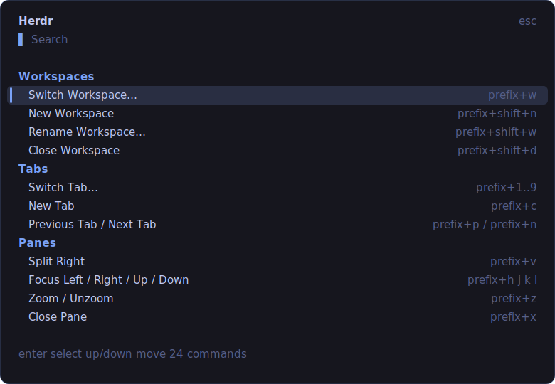

# herdr-palette

[](https://github.com/azwanzuharimi/herdr-palette/actions/workflows/ci.yml)

A Raycast-style, fuzzy-searchable command palette for [Herdr](https://herdr.dev).
Press a key, get a popup, type to filter herdr commands by name **or** key hint,
`Enter` to run. Built on the polished TUI engine from
[tmux-palette](https://github.com/), retargeted to drive Herdr via its CLI.



## Requirements

- [Bun](https://bun.sh)
- Herdr ≥ 0.7.0

## Install

```bash
git clone https://github.com/<owner>/herdr-palette ~/Sites/herdr-palette
cd ~/Sites/herdr-palette
./install.sh              # links plugin + adds prefix+space keybind + reloads
#   ./install.sh prefix+g   to bind a different key
```

Then **detach + reattach** (`prefix+q`, then `herdr`) for the keybind to apply —
herdr caches keybindings at client-attach, so a reload alone won't update an
already-attached client. The installer is idempotent (safe to re-run).

<details><summary>Manual install</summary>

```bash
bun install
herdr plugin link ~/Sites/herdr-palette      # or: herdr plugin install <owner>/herdr-palette
```
Add to `~/.config/herdr/config.toml` (any valid key; `prefix+?` collides with the
native help window):
```toml
[[keys.command]]
key = "prefix+space"
type = "plugin_action"
command = "azwan.herdr-palette.open"
description = "Command palette"
```
Then `herdr server reload-config` and reattach.
</details>

## Use

Press your key (default prefix `ctrl+b`). The palette opens as an overlay over
the active pane. Type to fuzzy-search by command name or key hint (`spl` → Split
Right, `prefix+v` also finds it). `Enter` runs, `Esc` dismisses. Rename commands
prompt for a name inline (type it, `Enter`).

### Commands

| Category | Commands |
|---|---|
| Workspaces | Switch, New, Rename, Close |
| Tabs | Switch, New, Rename, Close, Previous, Next |
| Panes | Split Right/Down, Focus Left/Right/Up/Down, Zoom, Rename, Close |
| Agents | focus a detected agent |
| Worktrees | New |
| System | Reload Config |

Relative pane commands act on the pane you launched from (its id/tab/workspace
are captured at launch and passed through), not the palette overlay.

**Not included** — herdr exposes no CLI/socket verb for these, so a plugin can't
trigger them (use their native keys): settings, detach, goto, notification
target, edit scrollback, resize mode, toggle sidebar.

## How it works

```
key → plugin action "open" → bin/open.sh
    reads HERDR_PANE_ID / HERDR_TAB_ID / HERDR_WORKSPACE_ID (the source)
    → herdr plugin pane open --entrypoint palette --placement overlay
        --env HERDR_PALETTE_SOURCE/TAB/WORKSPACE=…
    → bun src/cli.ts commands   (the TUI, cwd = plugin root)
        → pick → herdr <verb …> in-process → herdr tears the overlay down
```

Two herdr behaviors this design depends on (neither is obvious):

1. **Only `placement = overlay` panes receive the attached client's keyboard.**
   A `split` / `type="pane"` / plugin-split pane renders but stays dead to
   typing. The overlay is the one interactive launch surface, and herdr restores
   your previous pane when the palette exits.
2. **Keybindings are read at client attach.** Config changes need a reattach.

The palette uses the alternate screen buffer, so your pane is restored cleanly.
Because it runs inside a real pane it calls `herdr` directly via
`$HERDR_BIN_PATH` — no temp-file/wrapper round-trip.

## Extend

Drop JSON palettes in `~/.config/herdr-palette/palettes/<name>.json`, or add
items to `~/.config/herdr-palette/commands.json`.

## Develop

```bash
bun test            # engine tests
bunx tsc --noEmit   # typecheck
bun src/cli.ts commands   # run the TUI directly in a terminal (fully interactive there)
```

## License

MIT — see [LICENSE](LICENSE).
